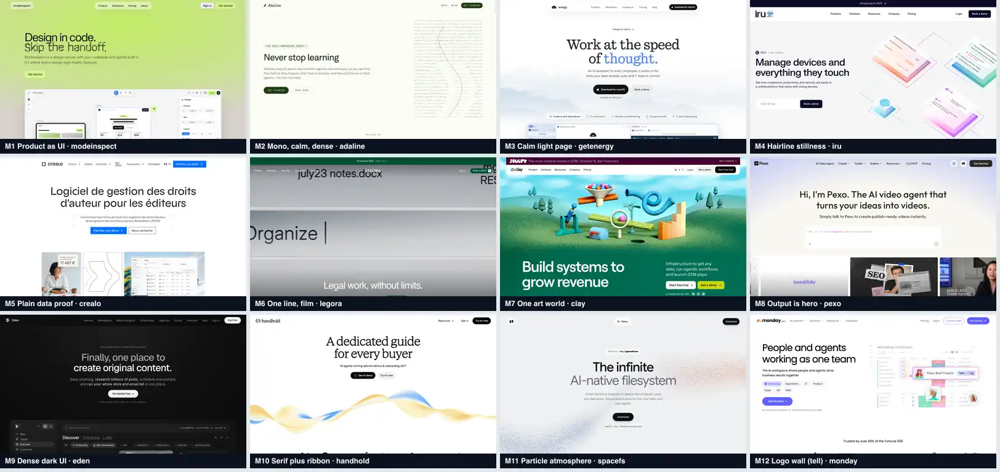

# Moodboard (Brief 01 v2.1, Step 1) — PROPOSAL, nothing locked

Source frames: `docs/research/design/<site>/desktop-1440-top.png` (raw PNGs are gitignored; the board above is the committed 69 KB WebP). Twelve tiles chosen from 14 sites. Each label is what to take; the right-hand column is what it must not turn into when HELIX borrows it.

| Tile | Site | Label | Take this (evidence) | Do not become |
|---|---|---|---|---|
| M1 | modeinspect | Product as UI | Product drawn as live markup, half in the first viewport; two-line headline at 67 px, tracking -0.049em (card: "Premium" 1, 3) | Lime radial glow, noise layers, glass pills, unlabelled invented UI |
| M2 | adaline | Mono, calm, dense | Mono caps for every control; product windows as real DOM with tabular data; hover is colour only at 150 ms (card: "Premium" 2, 3, 4) | Aurora/stars/ASCII ending, logo strip, same CTA five times |
| M3 | getenergy | Calm light page | The only earlier reference that met LCP <= 2.5 s while being light and calm (SYNTHESIS v0.0 §1) | Serif display; accent word in the headline |
| M4 | iru | Hairline stillness | One typeface, ink and white only, 1 px 10% hairlines, 0 of ~920 elements animated on scroll (card: "Premium" 1, 2, 4) | Logo marquee, chat popover over the cookie banner, glow video band |
| M5 | crealo | Plain data proof | A real table early; no decoration (SYNTHESIS v0.0 §5.8) | French-language placeholder portrait imagery |
| M6 | legora | One line, film | One 56 px line, 11 strings of text in the first viewport, one green (card: "Premium" 1, 3) | A 65.9 MB hero video; 78 elements at `opacity:0.001` until JS runs |
| M7 | clay | One art world | One consistent commissioned look across every asset (card: "Premium" 1) | 19.5 MB first load; logo + quote + stat bento; no HELIX equivalent exists (no art, no imagery rule) |
| M8 | pexo | Output is the hero | Show the result in the first 900 px; a pinned stepper whose no-JS fallback is a complete 2x2 (card: "Premium" 2, 3) | Prompt box, pastel wash, borrowed model names, 15 to 24 MB of video |
| M9 | eden | Dense dark UI | Density and numbered labels read as "serious tool" | Dark theme (excluded by light-mode rule) |
| M10 | handhold | Serif plus ribbon | The founder's reference: serif display, grain ribbon atmosphere, logo strip. See "adoptable under truth rules" below | Grain ribbon (gradient), logo strip (no permitted client logos), a page that renders nothing with JS off |
| M11 | spacefs | Particle atmosphere | Atmosphere that makes a plain headline feel considered | Canvas particles (excluded by Spec 14.6); LCP 27 s class of cost |
| M12 | monday | Logo wall (tell) | Included as the generic example, not as a source | The "Trusted by" strip with famous logos; HELIX has no permitted logos |

## The founder's handhold screenshot: what is adoptable under the truth rules

| Element | Adoptable? | Why |
|---|---|---|
| Serif display headline (light serif, about 72 px, weight 200) | Not by default | Geist is locked (D-05). A serif is a typography decision for the founder (Conflict C-4). The wordmark is heavy and extended, so a hairline serif would pull the page away from it, not toward it |
| Grain-textured abstract ribbon as atmosphere | Possible as a specification, not by default | Truthful (abstract, no claim). But it is a gradient/texture, which Spec 14.6 forbids, and it costs bytes: our bench measured a smooth still at 9 KB and the same still with real grain at 133 KB. See `MOTION_STACK_REPORT.md` and `HERO_REPORT.md` (image-generator spec) |
| Logo strip | **No** | HELIX has no permitted client logos (C-15 and Spec 4.5: no names or logos without written permission). A text-only traction line stays as `{{CONFIRM}}` |

## Taste translation (what the set agrees on, in one paragraph)

The pages that read as premium do it with type, tone and a few exact devices, not with effects: very tight display tracking (-0.03 to -0.049em on 10 of the 14 (measured -0.03 to -0.049em; the other four are -0.02 to 0)), hierarchy by tone, hairlines instead of shadows, product shown as a working object early, and one calm curve reused for every reveal. The pages that read as templated share a logo marquee, a stat strip, quote cards and two identical CTAs. HELIX cannot use the second group at all (no logos, no quotes, no metrics), which is a constraint that happens to point at the first group.
