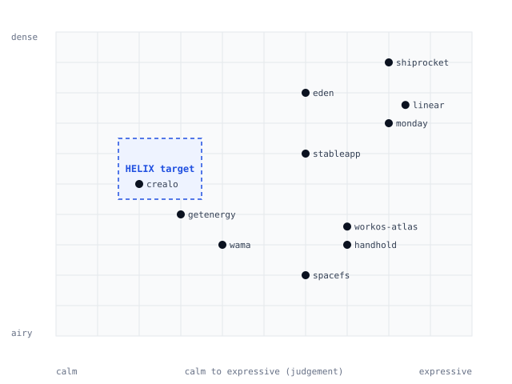

# Design research synthesis v1.0 (14 sites, 8 Oct 2026 lab round)

Evidence base: 14 home pages observed in real Chrome: the original eight (spacefs, eden, monday, getenergy, workos atlas, crealo, wama, handhold) plus six added in Brief 01 v2.1 (modeinspect, pexo, legora, iru, clay, adaline). Cards: `<site>/CARD.md`. Technology: [`TECH_FINGERPRINT.md`](TECH_FINGERPRINT.md). The v0.0 synthesis (12 sites including three calibration pages) follows unchanged below this section. Nothing is copied from a reference; patterns and ratios only. `?` means not checked, `-` not observed (not proof of absence), `~` partial.

## A. Asset-and-motion pattern matrix (patterns x 14 sites)

| Pattern | spacefs | eden | monday | getenergy | workos-atlas | crealo | wama | handhold | modeinspect | pexo | legora | iru | clay | adaline | count Y |
|---|---|---|---|---|---|---|---|---|---|---|---|---|---|---|---|
| Display headline tracking -0.03em or tighter (measured h1) | Y | Y | Y | Y | - | - | - | Y | Y | - | Y | Y | Y | Y | 10 |
| Centred hero | Y | Y | - | Y | Y | Y | Y | Y | - | Y | Y | - | - | - | 9 |
| Product UI (live or image) in the first viewport | - | Y | Y | ~ | ~ | ~ | - | - | Y | - | - | ~ | - | ~ | 3 |
| Product drawn as live DOM markup (not an image) | ? | ? | ? | ? | ? | ? | ? | ? | Y | ? | - | ? | - | Y | 2 |
| Customer-logo strip or marquee | - | - | Y | - | - | - | ~ | Y | Y | - | Y | Y | Y | Y | 7 |
| Stats, testimonials or quote cards on the home page | ? | ? | Y | ? | ? | ? | ? | ? | Y | ~ | Y | Y | Y | Y | 6 |
| Video as the hero visual | - | - | - | - | - | - | ~ | - | - | Y | Y | - | Y | - | 3 |
| WebGL or canvas visual you can see | Y | - | - | - | Y | - | - | Y | - | - | - | - | - | Y | 4 |
| Pinned or scroll-scrubbed scene | Y | - | - | - | - | - | - | - | - | Y | Y | - | - | Y | 4 |
| Full dark theme | - | Y | - | - | - | - | - | - | - | - | - | - | - | - | 1 |
| h1 and subhead visible with JavaScript off | Y | Y | Y | Y | Y | Y | Y | - | Y | Y | - | Y | Y | Y | 12 |
| Gradient-background elements, 20 or more (probe count; includes legibility scrims) | Y (36) | Y (99) | - (4) | Y (22) | Y (61) | - (2) | - (1) | - (2) | - (13) | Y (52) | - (12) | - (0) | Y (49) | - (2) | 6 |
| `requestAnimationFrame` still running at idle (probe; includes third-party) | Y (60) | - (0) | Y (184) | - (0) | Y (61) | Y (120) | Y (60) | Y (60) | - (0) | Y (30) | Y (120) | Y (121) | Y (248) | Y (120) | 11 |
| First-load JavaScript over 1 MB | - (872) | Y (1128) | Y (3838) | - (114) | Y (1554) | Y (1209) | - (391) | Y (1062) | - (528) | Y (1031) | Y (1234) | Y (2223) | Y (3151) | - (690) | 9 |
| Mobile Lighthouse 90 or above (3-run median) | - (55) | - (51) | - (29) | Y (98) | - (46) | - (58) | - (76) | - (60) | - (81) | - (57) | - (61) | - (67) | - (41) | - (78) | 1 |
| Smoothing behaviour observed on a wheel tick | - (2) | - (2) | - (2) | - (2) | - (2) | - (2) | - (2) | - (2) | - (2) | - (2) | - (2) | - (2) | - (2) | - (2) | 0 |
| `animation-timeline` in fetched CSS | - (0) | - (0) | - (0) | - (0) | - (0) | - (0) | - (0) | - (0) | - (0) | - (0) | - (0) | - (0) | - (0) | - (0) | 0 |

Rows 1 to 11 are judgements from first-viewport screenshots and the cards; the six rows beneath are automated or measured (value in brackets). The Lighthouse row is a 3-run median measured on 8 Oct 2026 on one machine; **wama scored 93 in the single run in the earlier round and 76 now (65, 76, 76)**, so single-run scores in the v0.0 matrix below are not comparable with these.

## B. The five patterns that most separate premium from generic across the set (ranked)

Method: the patterns that appear in the "makes it feel premium" list of the card **and** are absent or contradicted in the "generic" lists; then checked against what HELIX can truthfully do. Evidence is from the cards.

1. **The product shown as a working object, early.** Live markup with tabular mono data, status chips and a caption, not an illustration (modeinspect: a 1152 x 720 UI at about 506 nodes; adaline: windows at about 590 nodes on a plate; eden, monday in the first viewport). The sites that show illustration or output instead (clay, legora, pexo, spacefs) say less about what the product is. HELIX-truthful form: the operator-console frame, captioned and labelled until real captures exist.
2. **Colour quarantined to the product or one accent.** UI surfaces in white, off-white and ink with hairlines; saturated colour only inside the product windows or one accent (iru: all chroma in the Lottie and plates; adaline: two ramps, saturation only in windows; legora: one green). HELIX-truthful form: P1 with blue on the wordmark and one CTA, and no blue inside tenant windows.
3. **Stillness with one reused curve.** iru: 0 of about 920 elements changed under scroll; modeinspect: one expo-out curve for every reveal; adaline: colour-only hover at 150 ms and a 14 px, 520 ms rise. The premium feeling comes from what does not move. HELIX-truthful form: one moment per hero.
4. **A single clear type scale with tight display tracking and balanced wrapping.** Ten of the 14 measured at -0.03em to -0.049em on the h1; the premium five (modeinspect, adaline, iru, legora, clay) all do it with `text-wrap: balance`, and four of the five use one family at two or three weights. It is cheap, but it is **table stakes more than a separator**: ten of 14 do it, including sites whose cards list generic tells (monday, eden). HELIX-truthful form: Geist, plus the wordmark as the only heavy element.
5. **Lean first load.** Across the 14, mobile Lighthouse falls as first-load JavaScript rises (Spearman -0.75, n = 14). The only site above 90 (getenergy, 98) loads 114 KB of JS and 0.4 MB in total; the premium-feeling sites that score in the high 70s and 80s (modeinspect 81, adaline 78) load 528 and 690 KB. HELIX-truthful form: 0 KB of JS before and after interaction in all four heroes, measured.

Honourable mention that HELIX cannot use: **one commissioned art world used for every asset** (clay). It reads as the most premium thing in the set and costs 18 MB at first load; HELIX has no art direction brief, no images and no permission to use stock or AI imagery.

## C. Commodity patterns: on most sites, so using them makes HELIX look like everyone else

Counts from the matrix (n = 14 unless stated):

| Pattern | Sites | HELIX can use it? |
|---|---|---|
| Idle `requestAnimationFrame` loops (ambient motion, partly third-party) | 11 | Avoid: nothing should run at idle |
| Gradient wash, glow or aurora behind the hero | at least 6 by card (modeinspect, pexo, handhold, iru, adaline, clay) and 6 by gradient-element count | No (Spec 14.6) |
| Customer-logo strip or marquee | 7 (+1 partial) | No: no permitted logos |
| Centred hero | 9 | Possible (HERO-A) but undifferentiated |
| First-load JS over 1 MB | 9 | No |
| Stats, quotes or testimonials | 6 confirmed (+1 partial), 7 not checked | No: nothing to cite |
| Product mock in a window or card | most, incl. all four of this round's heroes | Yes, with labels; the **differentiator is what changes inside it** |
| Same CTA label repeated, header and hero identical | legora, clay, modeinspect (x3), adaline (x5), iru | Avoid: header outline, hero filled |
| Hero that never shows the product | legora (film), clay (illustration), pexo (output), spacefs, adaline (ASCII) | Avoid |
| Third-party tag stack | 12 of 14 confirmed to carry analytics, session-replay or visitor-ID scripts (the 8 earlier sites plus modeinspect, legora, iru, clay); pexo and adaline not checked | HELIX target: none except deferred privacy-friendly analytics |

## D. What this changes in the Lab (feeds THESIS.md, PATTERNS.md)
- The set is **less smooth and less library-driven than assumed**: no smoothing behaviour observed on any of the 14 (TECH_FINGERPRINT.md), so "premium smoothness" is not evidence for adding Lenis.
- The two sites closest to the handhold-style atmosphere reference (handhold itself and spacefs) are in the **slower half** of the set (Lighthouse 60 and 55; 1.1 MB and 0.9 MB of JS).
- Premium separation comes mostly from things HELIX can do for free (type, tone, restraint, a working product object), which is the thesis in THESIS.md.

---

# Earlier synthesis (v0.0, 8 Oct 2026, 12 sites)

Evidence base: 12 live pages observed in real Chrome (5 primary, 4 secondary, 3 calibration), home page only, desktop plus 1024 and 390 viewports. Cards: `<site>/CARD.md`. Numbers: [`MEASURED.md`](MEASURED.md). Motion: [`motion-catalogue.md`](motion-catalogue.md). Anything not measured is marked `NOT OBSERVED` in the cards. Nothing here is copied from a reference; principles and ratios only.

## 1. Research summary (one page)

1. **Richness is expensive, and most of the references are rich.** The seven pages built on WebGL or canvas heroes, gradient surfaces or hundreds of animations scored **30 to 42** on Lighthouse mobile performance with lab LCP of **5.9 to 27.4 s**. Only two pages scored 90 or above (getenergy 94, wama 93), and only getenergy met LCP <= 2.5 s while also being a calm, light-mode product page (136 KB JavaScript, 15 KB CSS, 39 requests). The HELIX targets (LCP <= 2.5 s, JS <= 90 KB) are met by almost none of the references, so the references can inform feel but not method.
2. **The feeling of "premium" is mostly typographic and structural, not decorative.** The recurring, cheap devices are: very large tightly tracked display type (about -0.02 to -0.035em), hierarchy by tone rather than weight or colour, hairline borders (0.5 to 1px at 6 to 12% opacity), one confident CTA, and a real product frame. These cost nothing in performance.
3. **The strongest credibility signal observed is a real, dense data screen early on** (stableapp's cost table with severity chips and large figures; crealo's rights table). That maps directly to HELIX (rate-card tables, AWB and COD figures). No reference achieves credibility through illustration.
4. **The incumbent in HELIX's market (Shiprocket) competes on noise**: promo banner, rainbow gradient, carousel, stock-style portrait, logo marquee, unverifiable counts ("4 Lakhs+ Businesses") and banned words ("Seamless", "Empowerment") in headlines. The EasyPost 3PL page, the nearest white-label shipping product found, leads with its demo form, has no navigation, and makes numeric claims ("100+ carriers", "99.99% uptime") that HELIX cannot make. HELIX's honest differentiator is to say less, truthfully, and to show the operator console.
5. **Accessibility and resilience are weak across the set.** Colour-contrast was the most common automated finding; one page (handhold) renders nothing with JavaScript disabled; five pages keep infinite animations running under reduced motion; four had a consent banner covering part of the first viewport.
6. **Third-party scripts are universal in the set (12 of 12).** HELIX's budget (none except deferred privacy-friendly analytics) is stricter than every reference, so no reference can be used as proof that a lean setup is normal.
7. **Implication for the Lab:** all three directions get their personality from type, shape, density, hairlines, the four locked signature devices and the product frame, not from gradients or motion. This is what makes the performance targets reachable.

## 2. Pattern-frequency matrix

Legend: **Y** observed, **~** partial or at the edge of the first viewport, **-** not observed in the frames I viewed, **?** not checked. Based on first-viewport and scroll-frame screenshots, computed styles and the harness data; "not observed" is not proof of absence.

| Pattern | spacefs | handhold | workos-atlas | eden | stableapp | monday | getenergy | crealo | wama | shiprocket | easypost-3pl | linear |
|---|---|---|---|---|---|---|---|---|---|---|---|---|
| Real product UI in first viewport | - | - (stylised) | ~ | Y | Y | Y | ~ | ~ | - (client work) | Y | - | ? |
| Centred hero | Y | Y | Y | Y | Y | - | Y | Y | Y | - | - | ? |
| Pill or fully rounded primary CTA | Y | Y | Y | Y | - | Y | Y | - | Y | - | - | ? |
| Tone-shift or emphasis inside the headline | Y | - | - | Y | - | - | Y (accent word) | - | - | - | - | ? |
| Dark theme | - | - | - | Y | - | - | - | - | - | - | - | Y |
| Canvas / WebGL / 3D element on page | Y | Y | Y | - | - | - | - | - | - | Y | - | - |
| Sticky or fixed header | Y (floating pill) | - | - | Y | - | - | Y | - | - | - | - | Y |
| Numbered, mono, or label-value device | - | - | Y | Y | ~ (outlined chips) | - | - | - | - | - | - | Y (mono font) |
| Audience or use-case selector (chips or tabs) | Y | - | Y | Y | - | Y | Y | - | - | - | - | - |
| Customer-logo wall or marquee | - | Y | - | - | Y | Y | - | - | Y (clients) | Y | - | - |
| Native `
` FAQ | - | - | - | - | - | - | Y (8) | - | - | - | - | - |
| Visible text with JS disabled | Y | **- (0 chars)** | Y | Y | Y | Y | Y | Y | Y | Y | Y | Y |
| Infinite animation under reduced-motion | - | - | Y (8) | Y (1) | - | Y (4) | Y (2) | - | - | - | - | Y (76) |
| Consent banner covering first viewport | - | Y | - | - | - | Y | Y | - | - | - | Y | - |
| Lighthouse mobile performance >= 90 | - (39) | - (38) | - (37) | - (42) | - (42) | - (31) | **Y (94)** | - (57) | **Y (93)** | - (57) | - (36) | - (30) |
| Third-party scripts of any kind (analytics, pixels, chat, visitor ID) | Y | Y (Plausible) | Y | Y | Y | Y | Y (small visitor-ID script) | Y | Y (Framer events) | Y | Y | Y (Intercom) |
| JS under 140 KB | - | - | - | - | - | - | **Y (136)** | - | - | - | - | - |

## 3. Positioning map

Axes are **judgement, informed by measured counts** (gradient elements, canvas, infinite animations, requests, text per viewport), not a computed score. Target for HELIX: **calm** (left) and **medium-dense** (upper middle), with the product frame carrying density rather than ornament.

| Site | Calm to expressive (0 to 10) | Airy to dense (0 to 10) | Basis |
|---|---|---|---|
| getenergy | 3 | 4 | one animation set, 22 gradient elements, lean payload |
| crealo | 2 | 5 | flat, 2px radii, no shadow, data table image |
| wama | 4 | 3 | typographic, image-led, scroll-timeline reveals |
| spacefs | 6 | 2 | particle canvas, pinned scroll story |
| handhold | 7 | 3 | WebGL ribbon, grain gradients |
| workos-atlas | 7 | 3 | 3D mascot, 61 gradient elements |
| stableapp | 6 | 6 | blobs plus dense product table |
| eden | 6 | 8 | dark, 395 SVGs, tabbed dense cards |
| monday | 8 | 7 | 377 requests, mascots, many CTAs |
| shiprocket | 8 | 9 | banner, carousel, logos, widgets |
| linear | 8 | 7 | 520 concurrent animations |
| **HELIX target** | 2 to 3 | 5 to 6 | calm, product-framed, tabular |

## 4. Taste translation

Several references sit in other categories or lean expressive. For each pattern you are likely drawn to (inferred from the reference list; correct me at Gate 1):

| Appeal | What actually drives it | How to deliver the same feeling, calmly, light, maintainable |
|---|---|---|
| Atmospheric backgrounds (particles, ribbons, blobs: spacefs, handhold, stableapp) | Depth, a sense that the product is "alive", and a break from flat white | Hatched paper (locked device), one `--accent-tint` field behind the product frame, corner brackets, soft `--shadow-2` on the frame. Static. Cost: zero JS |
| Two-tone display headline (spacefs, eden) | Hierarchy inside one headline without extra weight or colour | `--ink` first line, `--muted` second line (CSS only). Offered as a Lab toggle in all three directions; measured contrast of `--muted` on white is 4.97 to 6.31:1 |
| Product UI above the fold (eden, stableapp, monday) | "This is real software" in one glance | A real console screenshot framed with brackets and numbered markers; until it exists a labelled "Screenshot pending" frame. This is also the Spec's own hero rule |
| Typed or animated headline (eden) | Liveliness and a sense of authorship | A static headline plus one 250ms opacity/transform reveal of the product frame (motion moment 1). Never animate the LCP text |
| Pill CTAs and floating pill nav (spacefs, getenergy, handhold) | Modern softness and touch-friendliness | Offered as a shape variable (`--r-btn`): square 4, soft 10, pill 999. Header stays a plain sticky 64px bar |
| Mascot or 3D (workos-atlas) | Warmth and a memorable asset | Not delivered. Warmth comes from direction C (palette, radii, 18px body) instead |
| Dark theme (eden, linear) | Focus and "serious tool" feel | Locked out. Density, mono labels and a darker `--ink` CTA (direction B) give the serious-instrument feel in light mode |
| Numbered section labels (eden) | Order and rhythm | Already a locked device: mono index labels ("01 / Compare") |
| Bento grids (linear, ink-orbit) | Showing several capabilities at once | A 3-card static bento with diagrams (adapted `ink-orbit-features`, no fabricated live data) |

## 5. Transferable principles (with evidence)

1. **Make the product the proof.** Real UI early, not illustration (eden, stableapp, monday, shiprocket show UI in the first viewport; spacefs defers it and relies on atmosphere).
2. **State the category in one plain line.** Headlines in getenergy, crealo, wama and the spacefs sub-line name what the thing is; none depend on metaphor.
3. **One primary CTA per viewport.** Four of the five primary sites show one or two hero buttons (stableapp has none, only a nav CTA); monday and shiprocket add more paths and read busier.
4. **Hierarchy by scale and tone, not by colour.** Display sizes 57 to 84px with -0.02 to -0.035em tracking recur (spacefs 76, workos 84, eden 58, handhold 72, getenergy 80).
5. **Hairlines over shadows.** Premium surfaces use 0.5 to 1px borders at 6 to 12% opacity (spacefs inset 0.5px, eden 7 to 10% white, getenergy 6 to 10%).
6. **Restraint in motion predicts performance.** The two pages scoring >= 90 are the two with the least motion and gradient work.
7. **Richness has a measurable bill.** WebGL, canvas heroes and hundreds of animations co-occur with LCP of 6 to 27 s in this lab.
8. **Real tables build trust.** stableapp and crealo put dense data on screen early; large numerals and outlined severity chips carry authority.
9. **Label | value pairs and mono labels explain compactly.** workos-atlas pills, eden numbered eyebrows, linear mono labels.
10. **Name the audience near the headline.** monday and getenergy use chips or tabs for roles and use cases.
11. **Use native elements for disclosure.** getenergy's eight `
` items work without JavaScript.
12. **Content must survive without JavaScript.** handhold's blank no-JS page is the counter-example; every other page kept its text.
13. **Do not let a consent banner cover the first viewport.** Four of twelve did. (With privacy-friendly, cookieless analytics HELIX may need no banner at launch; a legal-review item.)
14. **Reserve space for media and forms.** easypost-3pl CLS 0.305 and crealo 0.082.
15. **Do not state what you cannot show.** Incumbents lead with counts and uptime figures that a visitor cannot verify; HELIX's claim register forbids them, so its credibility must come from the console, the entity block and a working contact.

## 6. Explicit reject list

Dark theme; WebGL, canvas, particle or 3D mascot backgrounds; typed or auto-advancing headlines; scroll pinning and scroll-jacking (including `preventDefault` on wheel or touch and smooth-scroll libraries); logo walls and marquees; carousels; investor, award or "backed by" badges; numeric or uptime claims; stock or portrait photography; backdrop-blur headers; third-party chat launchers; full-page consent overlays; gradient text and gradient blobs; infinite or looping animation; serif or light display weights (Geist is locked).

## 7. What incumbents say versus what HELIX can truthfully say (factual, non-disparaging)

| Observed on the incumbent or nearest peer (home or landing page, 8 Oct 2026) | What HELIX can truthfully say today |
|---|---|
| Shiprocket headline: "Your Partner for eCommerce Empowerment"; sub-line "end-to-end"; counts such as "4 Lakhs+ Businesses" | "HELIX is a white-label, multi-tenant logistics operating system built by Cyper Studio." Founded 2024. No counts |
| Shiprocket product copy uses "Seamless" in a heading | Plain verbs from the claim register once confirmed: compare, book, print, recover, settle |
| EasyPost 3PL sub-headline: "100+ carriers. 99.99% uptime." | No carrier count and no uptime until verified (C-07, C-16) |
| Both lead with a sign-up or demo form (Shiprocket adds a promo banner and a logo marquee) | A real console screenshot, an entity block with legal name and `info@` on the same domain, and a short form later on the page |

## 8. Limits of this research

Home pages only; no pricing, docs or mobile-menu states; no frame capture of JS or WebGL motion; single Lighthouse run per site on a developer machine; automated accessibility only; no real devices. The positioning axes are judgement. Calibration choices were mine: Shiprocket (market incumbent), EasyPost 3PL (nearest white-label shipping product the search surfaced), Linear (intended as a calm infrastructure benchmark but observed to be dark and heavy, so it is recorded as a counter-example).
